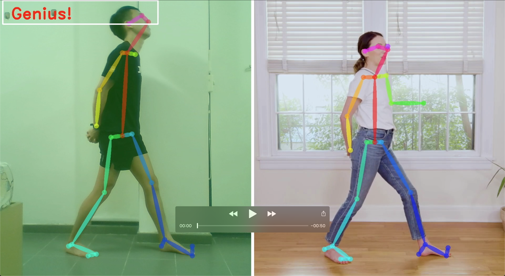
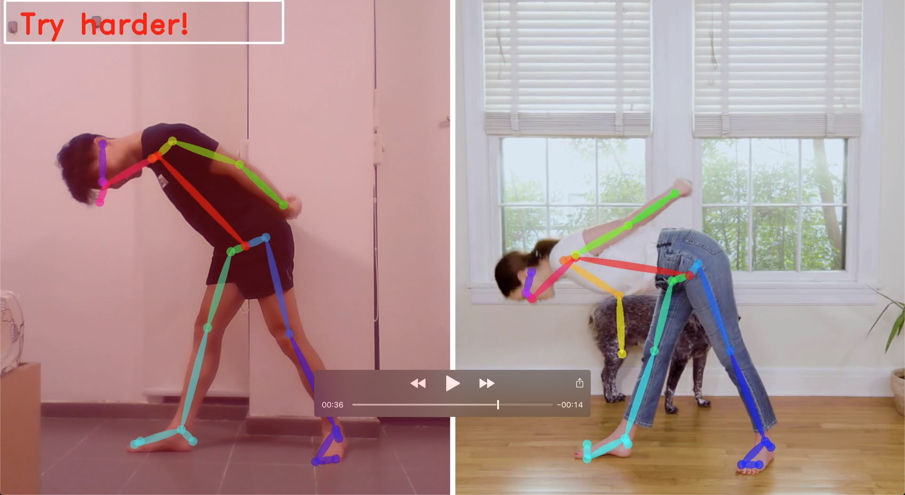

# CV-pose-detection
This project is concerned with verifying whether the user is performing yoga poses correctly. To do so, we extract the user's pose information from an image of him using OpenPose and compare it with the target yoga pose. If the two poses have a high similarity score, we treat the user's pose as correct. Two methods of comparison were attempted and they are namely cosine similarity and using a fully connected neural network. The neural network was found to outperform cosine similarity significantly when they were evaluated through their receiver operating characteristics (ROC). The demo script uses the neural network for comparison. The neural network is also affectionately named ComparatorNet. 

## Files
We compared two methods of calculating similarity scores. They are namely using cosine similarity and using a neural network. 

+ ComparatorNet.h5: Contains our neural network
+ ComparatorNet.ipynb: Jupyter notebook used to build our network along with its evaluation
+ Cosine similarity.ipynb: Jupyter notebook used to evaluate the cosine similarity method
+ get_openpose_coords.py: Script to run through our entire image dataset and extract pose coordinates using OpenPose
+ model_history_log.csv: Allows me to plot loss and accuracy over time after I have trained the neural network
+ demo.py: Demo file. It's pretty cool to run if you have OpenPose installed properly

The coords directory contains all the pose coordinates extracted from our image dataset. The image dataset will not be made available here. 

## Getting Started
These instructions will get you a copy of the project up and running on your local machine for development and testing purposes. 

### Prerequisites
You will need:
+ A machine with Nvidia GPU with minimally 2GB of memory
+ OpenPose
+ Ubuntu
+ CUDA
+ cuDNN
+ Python 3

The project was tested with the following setup:

| Item          | Version/Model           |
| ------------- |:----------------------- |
| GPU           | Nvidia GeForce GTX 965M |
| Ubuntu        | 16.04.6 LTS             |
| Nvidia driver | 418                     |
| CUDA          | 10.1                    |
| cuDNN         | 7.5                     |
| OpenPose      | 1.4.0                   |
| Pytorch       | 1.0.1                   |
| Python 3      | 3.5.2                   |

[Documentation](https://docs.nvidia.com/deeplearning/sdk/cudnn-install/index.html) I followed to install Nvidia drivers, CUDA and cuDNN.

[Github link](https://github.com/CMU-Perceptual-Computing-Lab/openpose) for OpenPose. They have fairly detailed installation instructions. When you are installing OpenPose, make sure to install OpenPose such that it can be used for other projects. There's a section under installation call "OpenPose from other Projects (Ubuntu and Mac)"

[Pytorch](https://pytorch.org/) installation instructions. 

The steps are quite long but well documented so I shall not repeat them here. 

### Installing
After you have installed the prerequisites, getting the project running is easy. Just clone this repository in the same directory with OpenPose. i.e. the folder structure should look like

```
.
+-- openpose
+-- CV-pose-detection
```

The git clone command
```
git clone https://github.com/nosyarlin/CV-pose-detection.git
```

After which, install requirements.txt
```
cd CV-pose-detection
pip3 install -r requirements.txt
```

Finally, run the demo
```
python3 demo.py
```

Here are some images of our project in action
<p align="center">
    
    
    <br>
    <sup>Jason trying his best to do yoga</sup>
</p>

## Authors

* [Rayson Lim](github.com/nosyarlin)


## Acknowledgments

* This project is made possible by the [team](https://github.com/CMU-Perceptual-Computing-Lab) behind OpenPose
* Yoga video is by Adriene, Y. W. (2019, March 30). Office Break Yoga | 14 Min. Yoga Practice | Yoga With Adriene. Retrieved from https://www.youtube.com/watch?v=M-8FvC3GD8c
